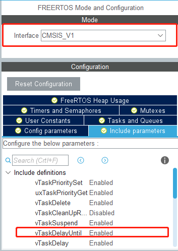
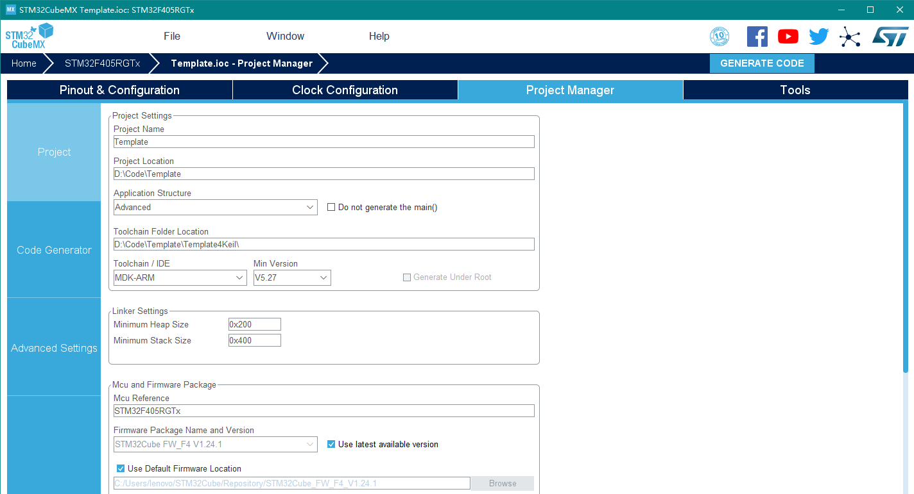
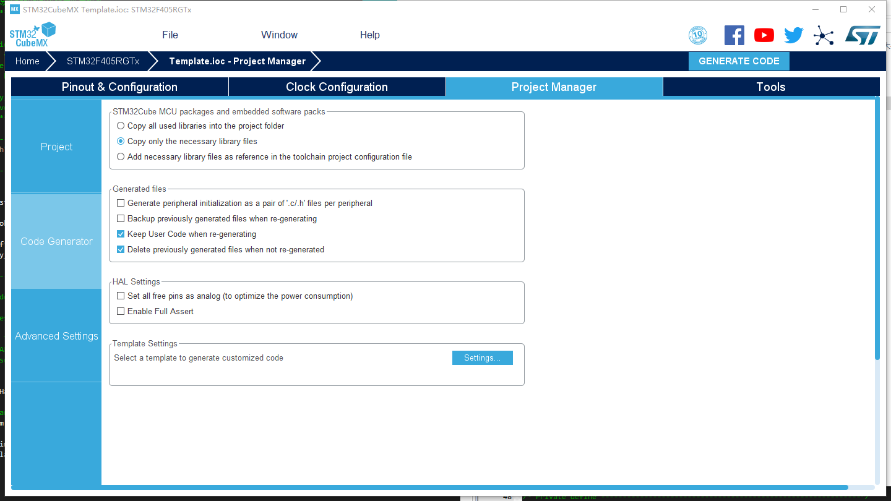
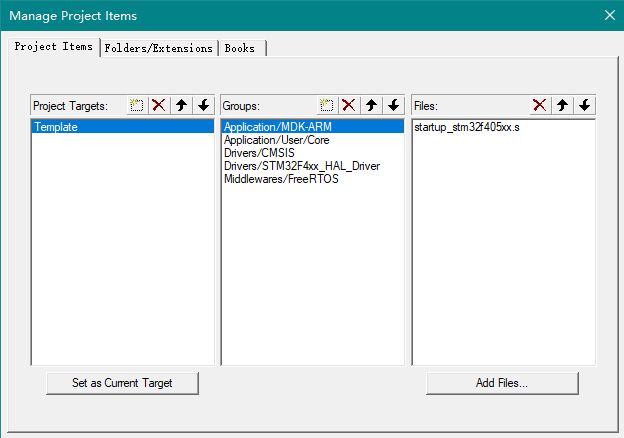
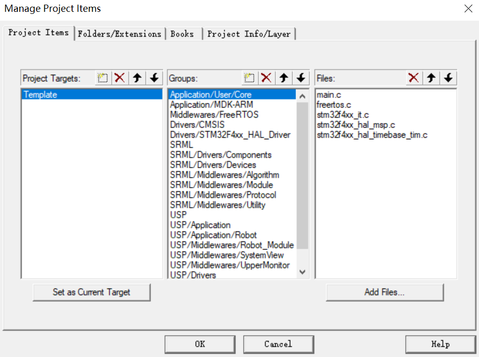
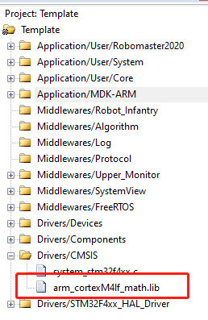
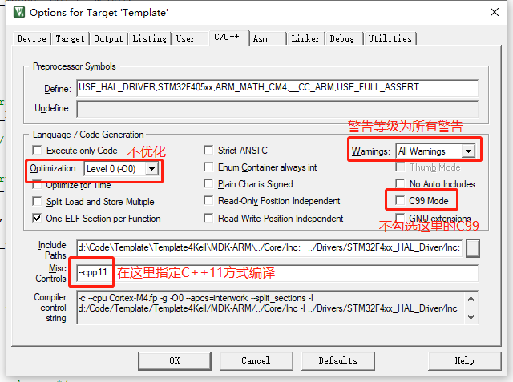
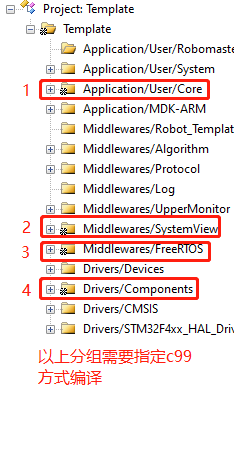
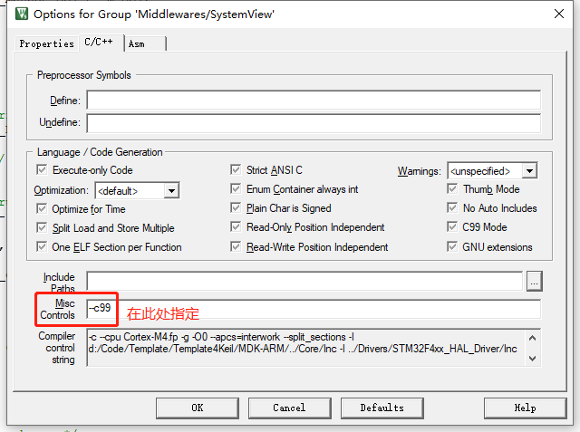
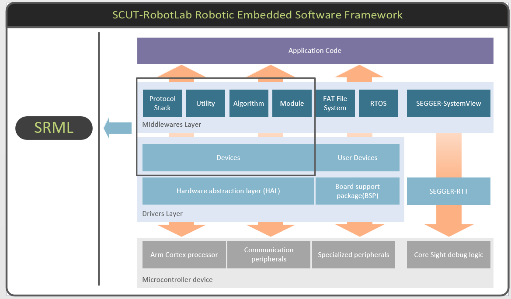

# **如何创建一个新的项目？**

## Keil MDK V5的项目

### 1. STM32CubeMX的配置

  > **配置项目**

- 配置引脚、片上资源、中断等。
- 配置FreeRTOS参数及内存，必须使用CMSIS_V1接口，使能vTaskDelayUntil()参数。

  


  > **配置项目生成选项与参数，选择`Advance`模式。**

  

  > **配置代码生成选项与参数**：

   - 自己的项目推荐使用`Copy only necessary library files`否则会生成120M的用不到的库文件。在模板工程中为了提供数学库文件，便生成了所有库文件。不需要使能HAL库断言，可在有需要用的时候自行在预编译宏添加`USE_FULL_ASSERT`。

  

### 2. 添加文件到根目录

  根目录的文件由两部分构成，如图：

  1. **SRML**:电控通用代码库(SCUT-RobotLab Middle Layers),其中包含：
     - **Middlewares**:面向上层及驱动层的通用标准中间件，如各种算法、滤波器、控制器等。
     - **Drivers**:提供对片上外设资源基于HAL库的进一步封装和板接设备自定义的通用标准驱动。

  2. **USP**：用户自定义的文件（User Support Package），其中包含：
     - **Application**应用层内部分两层：
       1. **系统服务层**:调用`Drivers`和`Middlewares`的接口实现系统的功能，为`Application`提供接口。
       2. **用户层**:具体应用`app`提供的功能，如遥控控制机器人、键盘控制机器人、自动跳舞等。

     - **Middlewares**:面向上层及驱动层的非SRML的中间件,如上位机，Systemview，模块，机器人对象的抽象等等。

     - **Drivers**:提供对片上外设资源基于HAL库的进一步封装和板接设备自定义的非SRML的驱动。


其中SRML需要通过使用Git Sub Module添加到项目根目录中。USP可使用模板工程的或符合工程规范的代码文件。

### 3.Keil C/C++选项卡的配置


###  4. Keil工程目录的配置

> 默认生成代码的目录结构。



> 手动配置代码的目录结构，添加对应文件到各个`Group`。


- 工程主要分三层：Application、Middlewares、Drivers 。
  
  
  
- `Application`层只可调用下层文件，不可被下层文件调用，推荐分组如下。
  
- `Middlewares`层内容比较多，推荐分组如下。
  
- `Drivers`层包含各种片上及板载资源的驱动。



>最后添加CMSIS-DSP的数学库。从模板工程目录下找到库文件，然后复制到项目下文件夹并添加到工程目录中，编译的时候就会链接到：

`"Template4Keil\Drivers\CMSIS\Lib\ARM\arm_cortexM4lf_math.lib"`



- 编译选项：



- 分组编译选项




### 5. 关于项目的说明

- 一般来说对于不同的项目，不同的部分应该是`Middlewares/Robot_xxx`、`Application/User/`等分组。没有用到的部分可以不用添加。
    - `Application/User/Core`：不同配置下STM32CubeMX生成的内容不同,中断文件要添加的回调函数不一样。
    - `USP/Application`:系统服务层文件，不同项目面向的具体功能不一样。一般都包含`app、callback、task`。
      1. **`app:`**完成所有资源的初始化，创建所有任务。
      2. **`Service_Devices:`**通过设备服务提供的接口就可实现设备的功能，而不需要关注如何实现。比如：要控制电机只需要调用`Motor.SetTarget(0)`。
      3. **`Service_Communication:`**通过通信服务提供的接口就可实现通信功能，而不需要关注如何实现。比如：后续添加例子。
    - `Application/User/Robomaster2020`用户层不是必要的。
    - `Middlewares/Robot_Module存放机器人抽象代码、模块代码




# 如何配置一个新的项目？

- `main.c`的修改：

  - 添加头文件`#include "System_Config.h"`

  - 在`main()`中操作系统初始化前添加`System_Resource_Init()`

  - 修改默认新建的任务为以下内容，以完成初始化：

    ```c++
    void main()
    {
      /*Other init.*/
      System_Resource_Init();
        
      /*Before osKernelStart*/
      osKernelStart();
    }
    
    void StartDefaultTask(void *argument)
    {
      /* USER CODE BEGIN 5 */
      /* Infinite loop */
      for(;;)
      {
        System_Tasks_Init();
          
        /* Delete the default task. */
        osThreadTerminate (defaultTaskHandle);
      }
      /* USER CODE END 5 */ 
    }
    ```

  - 如果使用到`drv_timer`模块，则需修改定时器中断回调函数为(模板工程配置的是TIM4用于延时，需要打开中断)：

    ```c++
    void HAL_TIM_PeriodElapsedCallback(TIM_HandleTypeDef *htim)
    {
      /* USER CODE BEGIN Callback 0 */
      if (htim->Instance == TIM4) {
        Update_SystemTick();;
      }
      /* USER CODE END Callback 0 */
      if (htim->Instance == TIM7) {
        HAL_IncTick();
      }
      /* USER CODE BEGIN Callback 1 */
    
      /* USER CODE END Callback 1 */
    }
    ```

- 如果使用到Systemview，需要修改`FreeRTOS.h`，详细内容参见Confluence的这篇[Blog](https://www.scut-robotlab.cn/confluence/x/AQFT)。

  

# 如何用Template配置一个属于自己的新项目？
如果您认为重新创建工程过于麻烦，可以选择从原有的工程中做一些改变,变成您自己的空工程，如改成xxx工程。
- 文件夹名的更改：
  -'Template' -> 'xxx'
  -'Template.ioc' -> 'xxx.ioc'
  -'MDK-ARM\Template.uvprojx' -> 'MDK-ARM\xxx.uvprojx'
-MDK-ARM文件夹中删除 **除** 'xxx.uvprojx'以外所有文件
-用记事本打开'xxx.uvprojx'将所有的Template替换为xxx
- 'Template.ioc'重新生成工程